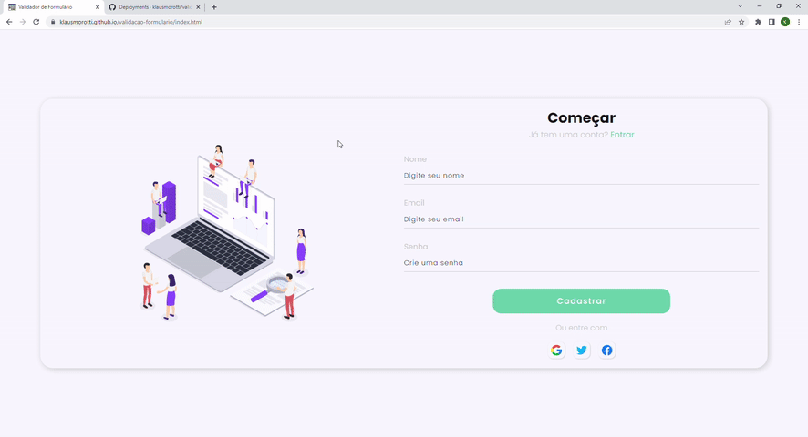

<h1 align="center">VALIDADOR DE FORMULÁRIO</h1>

> 🔎 Um Formulário de contato com validação JavaScript para que sejam enviadas apenas informações válidas.  
🗔 Confira a aplicação: https://klausmorotti.github.io/validacao-formulario/  

## 📄 Explicação

O projeto validador de formulário consiste em um formulário com uma validação Front-End utilizando JavaScript, criado com objetivo de pré validar informações que posteriormente serão enviadas para um servidor para serem validadas trazendo um retorno ao usuário.

A página contém os recursos:

* Validação JavaScript para quantidade mínima de caracteres.
* Validação JavaScript para validar se o campo contém um email.
* Validação JavaScript para verificar se o campo de senha há no mínimo 8 caracteres.
* Página de confirmação de login feito com sucesso caso passe pela validação.

## 📁 Páginas

O site tem no total 2 páginas, sendo elas

- **Página principal:** A página principal que exibe todo nosso formulário com a validação.
- **Página de confirmação:** A página onde retorna uma resposta sobre o formulário enviado com sucesso.

## 🎯 Etapas do projeto

✔️ Criando a interface do projeto.  
✔️ Decidindo quais as validações seriam feitas.  
✔️ Planejando lógica utilizada para validação com JavaScript puro.  
✔️ Implementação da lógica desenvolvida para validação.  
✔️ Responsivizando projeto.  
✔️ Criando página de "login feito com sucesso".
✔️ Projeto Finalizado.  

## 🚀 Tecnologias
* <a href="https://developer.mozilla.org/pt-BR/docs/Web/HTML" target="_blank">HTML</a>
* <a href="https://developer.mozilla.org/pt-BR/docs/Web/CSS" target="_blank">CSS</a>
* <a href="https://developer.mozilla.org/pt-BR/docs/Web/JavaScript" target="_blank">JavaScript</a>

## 🤝 Colaboradores

<table>
  <tr>
    <td align="center">
      <a href="#">
         
        
          <b>Klaus Morotti</b>
        
      </a>
    </td>
  </tr>
</table>

## 📝 Licença

Este projeto está sob licença. Consulte o arquivo <a href="https://github.com/klausmorotti/validacao-formulario/blob/master/LICENSE">LICENSE</a> para obter mais detalhes.

<a href="#top">Volte para o topo</a>
